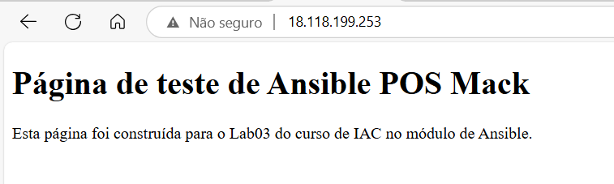

# Aula 3 - Provisionando servidor e instalando NGINX utilizando o Ansible

1. Criar uma NOVA INSTÂNCIA EC2 na AWS
2. Atribuir essa NOVA INSTÂNCIA ao grupo de segurança criado na aula anterior
3. Liberar a porta 80 no grupo de segurança
4. Conecte-se na NOVA INSTÂNCIA, usando o método EC2 Instance Connect ou o SSH client através do SERVIDOR PRINCIPAL, com a chave .pem que foi configurada na pasta files
5. NA NOVA INSTÂNCIA, cadastre a chave SSH do SERVIDOR PRINCIPAL
```
vim ~/.ssh/authorized_keys
```
**Cole em uma nova linha a chave SSH gerada no SERVIDOR PRINCIAL e salve o arquivo**
6. Volte ao SERVIDOR PRINCIPAL e adicione o IP publico da NOVA INSTÂNCIA no seu arquivo de **~/files/hosts** em um novo grupo:
```
[posmack_web]
18.118.199.253
```
7. Execute o comando abaixo para instalar o NGINX via ansible na NOVA INSTÂNCIA
```
ansible posmack_web -i hosts -m shell -a 'apt install nginx -y' --become
```
8. Verifique se a instalação do NGINX ocorreu com sucesso listando seu status com o comando abaixo:
```
ansible posmack_web -i hosts -m shell -a 'service nginx status' --become
```
9. Volte a NOVA INSTÂNCIA via SSH, entre na pasta onde está disponibilizado o arquivo padrão do NGINX e entre em modo de edição
```
cd /var/www/html
sudo vim index.nginx-debian.html
```
10. Cole o conteúdo abaixo no arquivo:
```
<!DOCTYPE html>
<html lang="pt-br">
<head>
    <meta charset="UTF-8">
    <meta name="viewport" content="width=device-width, initial-scale=1.0">
    <title>Bem-vindo ao Nginx</title>
</head>
<body>
    <h1>Página de teste de Ansible POS Mack</h1>
    <p>Esta página foi construída para o Lab03 do curso de IAC no módulo de Ansible.</p>
</body>
</html>
```
11. Para confirmar se as alterações obtiver êxito acesse através de um navegador o IP Público da NOVA INSTÂNCIA, o resultado deverá ser:
